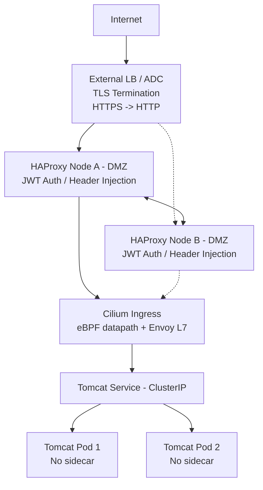
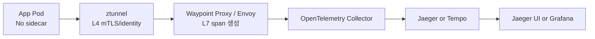

# Sidecar-less Architecture 기반 분산 Trace 설계 보고서 v2

**작성일:** 2026-05-14  
**작성 범위:** 최초의 **Argo CD 최신 버전 질의**를 제외하고, 이후 대화에서 논의한 Sidecar-less Architecture, Service Mesh, Non-Mesh, Distributed Trace, Jaeger, Tempo, OpenTelemetry, DeepFlow, Cilium, HAProxy 기반 구조를 정리합니다.  
**전제 조건:** 소스코드 수정 또는 개발 없음, Pod별 trace sidecar 없음, 분산 trace 또는 trace-like AutoTracing 가능 구조만 주요 후보로 분류합니다.

---

## 0. 검수 기준 및 보증 한계

본 보고서는 대화 내용을 기준으로 기술 설계 의사결정에 활용할 수 있도록 정리한 **전문 검토 문서**입니다. 다만 “모든 환경에서 100% 동일하게 동작한다”는 의미의 보증 문서는 아닙니다. 특히 eBPF 기반 AutoTracing, Cilium Service Mesh의 Envoy tracing, DeepFlow의 span correlation, TLS/mTLS 환경의 L7 가시성은 커널, CNI, 프록시 설정, 암호화 지점, 프로토콜, 런타임에 따라 PoC 검증이 필요합니다.

| 검수 항목 | 반영 여부 | 비고 |
|---|---:|---|
| 사용자가 제시한 HAProxy + Cilium Ingress + Tomcat 구조 해석 | 반영 | Service Mesh가 아닌 sidecar-less ingress 인증/라우팅 구조로 정의 |
| Service Mesh / Non-Mesh sidecar-less 구분 | 반영 | 각각 표준 아키텍처 우선순위와 리소스 요구량 순위로 분리 |
| 소스코드 수정/개발 없음 조건 | 반영 | OTel Auto Instrumentation, APM Agent, eBPF 중심으로 필터링 |
| Jaeger / Tempo / OTel / DeepFlow / Cilium / Hubble / NHN Flow Log 관계 | 반영 | trace와 flow/log/metric을 구분 |
| DeepFlow 분산 trace 표현 | 정정 반영 | 표준 OTel trace가 아닌 eBPF AutoTracing/full-stack correlation으로 기술 |
| Sidecar trace와 Service Mesh sidecar 차이 | 반영 | Jaeger Agent/OTel Collector sidecar는 신규 표준으로는 후순위 |
| 추가 CNCF/Observability 후보 | 반영 | OBI/Beyla, Odigos, SigNoz, OpenObserve, Uptrace, HyperDX, Pixie, Coroot, Anteon 등 포함 |

---

## 1. 핵심 결론

1. **Trace를 보기 위해 Service Mesh가 반드시 필요한 것은 아닙니다.** Service Mesh는 trace를 생성할 수 있는 여러 경로 중 하나입니다.
2. Kubernetes/MSA/Cloud Native 문맥에서 “trace”는 대개 **분산 trace**를 의미하지만, 일반적으로 trace라는 단어 자체가 항상 distributed trace만을 뜻하지는 않습니다.
3. “추적 관리”라는 요구사항은 고정된 기술명이 아니며, Cloud Native 문맥에서는 **로그·메트릭·네트워크 흐름·분산 trace**를 포함하는 통합 추적 체계로 정의하는 것이 안전합니다.
4. 기존 Istio + Jaeger 구조는 대개 **각 Pod의 istio-proxy Envoy sidecar가 span을 생성하고 Jaeger가 저장/조회**하는 구조였습니다. Jaeger가 sidecar로 붙는 구조가 아닙니다.
5. Istio Ambient에서는 Pod별 sidecar를 없애고, **ztunnel은 L4, Waypoint Proxy는 L7 span 생성**을 담당합니다. L7 trace는 Waypoint가 핵심입니다. [R1], [R2]
6. OpenTelemetry Collector는 필수는 아니지만, 운영에서는 batch, memory limit, sampling, routing, backend 교체를 위해 넣는 것이 권장됩니다. [R4]
7. Jaeger all-in-one은 PoC/개발용에 가깝고, 운영에서는 Collector, Query, Storage를 분리해야 합니다. [R3]
8. DeepFlow는 “분산 trace가 안 되는 도구”가 아니라, **표준 OTel/Jaeger/Tempo trace와 다른 eBPF 기반 AutoTracing/full-stack correlation 도구**입니다. DeepFlow Helm CE는 일반적으로 DeepFlow Server/Agent + ClickHouse + Grafana로 조회합니다. [R8], [R9], [R10]
9. Cilium + Hubble은 강력한 네트워크 flow/service map 관측 도구이지만, 단독으로 Jaeger/Tempo식 trace_id/span_id 기반 분산 trace를 보장하지 않습니다. [R12]
10. 사용자가 제시한 HAProxy + Cilium Ingress + Tomcat 구조는 Service Mesh가 아니라 **Service Mesh 미도입 환경의 Sidecar-less Ingress 인증/라우팅 아키텍처**입니다.

---

## 2. 팀장님께서 제시하신 구성도 



### 2.1 구조의 정확한 명칭

**Service Mesh 미도입 환경에서의 Sidecar-less Ingress 인증/라우팅 구조**입니다. 더 구체적으로는 다음과 같습니다.

```text
External LB/ADC + DMZ HAProxy JWT Auth + Cilium Ingress + Tomcat Service
```

### 2.2 구성요소별 역할

| 항목 | 역할 | 주의점 |
|---|---|---|
| External LB / ADC | 외부 HTTPS 수신, TLS termination, HAProxy로 전달 | “L4 LB”가 SSL termination을 한다면 실제로는 TLS offload/HTTPS listener/ADC 성격입니다. |
| HAProxy A/B | JWT 검증, 기존 X-User 헤더 제거, 신뢰된 X-User 헤더 재주입, DMZ 경계 | 사용자 위조 헤더 방지 설계가 필수입니다. |
| HAProxy peers | Stick-table sync | 세션/상태성 정책 사용 시 필요합니다. |
| Cilium Ingress | Kubernetes 내부 ingress routing | Cilium datapath는 eBPF이나 L7 HTTP 처리는 Envoy 기반으로 보는 것이 정확합니다. [R11] |
| Tomcat Service/Pods | 비즈니스 애플리케이션 | Pod에는 service mesh sidecar가 없습니다. |

### 2.3 이 구조가 Service Mesh가 아닌 이유

| 비교 항목 | 사용자 제시 구조 | Service Mesh |
|---|---|---|
| Pod별 sidecar | 없음 | 기존 Istio는 있음, Ambient는 없음 |
| 서비스 간 mTLS | 기본 제공 아님 | 핵심 기능 |
| 서비스 간 L7 정책 | Ingress/HAProxy 수준 중심 | 서비스 간 east-west까지 가능 |
| 서비스 간 분산 trace | 기본 없음 | Envoy/Waypoint 기반 가능 |
| 주 목적 | 외부 진입 트래픽 인증/라우팅 | 서비스 간 통신 제어/보안/관측 |

### 2.4 보안 고려사항

| 고려사항 | 권장 대응 |
|---|---|
| X-User 헤더 위조 | HAProxy에서 inbound X-User 제거 후 재주입 |
| K8s Ingress 직접 접근 | DMZ HAProxy 외 직접 접근 차단 |
| HAProxy-K8s 구간 평문 HTTP | 보안 요구가 높으면 TLS re-encryption 검토 |
| 내부 신뢰 경계 | HAProxy를 인증 주체로 명확히 정의 |
| 네트워크 통제 | SG/NACL/Firewall/Cilium NetworkPolicy 적용 |
| 감사/추적 | HAProxy access log, Cilium/Hubble, OTel trace를 분리 설계 |

---

## 3. Trace, Distributed Trace, 추적 관리 정의

| 용어 | 의미 | 예시 |
|---|---|---|
| Trace | 실행 흐름 추적이라는 넓은 개념 | 단일 앱 내부 함수/DB 호출 trace, packet trace, stack trace |
| Distributed Trace | 하나의 요청이 여러 서비스/Pod/API/DB/MQ를 지나가는 전체 흐름 추적 | frontend -> order-api -> payment-api -> DB |
| Span | Trace 안의 개별 작업 단위 | HTTP handler, DB query, external API call |
| Trace Context | 여러 서비스의 span을 하나의 trace로 묶는 ID/헤더 | W3C traceparent, B3 header |
| 추적 관리 | 고정 기술명이 아니라 요구사항 표현 | 로그 추적, 네트워크 흐름 추적, 변경 추적, 분산 trace 포함 가능 |

### 3.1 핵심 구분

```text
Trace = 실행 흐름 추적
Distributed Trace = 여러 서비스에 걸친 요청 흐름 추적
```

### 3.2 Cloud Native 요건에서의 추적 관리 권장 정의

```text
추적 관리 = 로그 기반 추적 + 메트릭 기반 상태 추적 + 네트워크 흐름 추적 + 요청 단위 분산 추적
```

---

## 4. Service Mesh와 Non-Mesh에서의 Trace 관계

| 구분 | Trace 가능 여부 | 대표 계측 방식 | 장점 | 한계 |
|---|---:|---|---|---|
| Service Mesh | 가능 | Envoy sidecar 또는 Waypoint | 서비스 간 호출 흐름 자동 관측 | 앱 내부 함수/비즈니스 span은 제한적 |
| Non-Mesh | 가능 | OTel Auto Instrumentation, APM Agent, eBPF | Mesh 없이도 분산 trace 가능 | 계측 방식별 런타임/프로토콜 제약 |
| Cilium + Hubble 단독 | trace-like flow 가능 | eBPF network flow | 네트워크/정책/drop 관측 강함 | 표준 분산 trace 아님 |
| DeepFlow 단독 | eBPF AutoTracing 가능 | eBPF correlation | 네트워크/시스템/API 상관분석 강함 | 표준 OTel trace와 동일하지 않음 |

---

## 5. 기존 Istio + Jaeger 구조와 Ambient 전환

### 5.1 기존 Istio + Jaeger

```text
App Pod
  ├─ application
  └─ istio-proxy Envoy sidecar
        -> Jaeger Collector
        -> Jaeger Query/UI
        -> Storage
```

| 항목 | 정리 |
|---|---|
| span 생성 | 각 Pod의 istio-proxy Envoy sidecar |
| Jaeger 역할 | trace 저장/조회 backend/UI |
| Jaeger all-in-one | PoC/개발에서 흔함, 운영 비권장 [R3] |
| 운영형 Jaeger | Collector, Query, Storage 분리 |
| 필수 전제 | trace context header 전파 |

### 5.2 Istio Ambient + Jaeger/Tempo




| 항목 | 정리 |
|---|---|
| ztunnel | L4 mTLS, identity, L4 telemetry. HTTP header를 파싱하지 않습니다. [R2] |
| Waypoint Proxy | Envoy 기반 L7 처리, L7 trace span 생성 지점. [R1], [R2] |
| OTel Collector | 필수는 아니지만 운영 권장. batch, memory limiter, sampling, routing. [R4] |
| Jaeger | 기존 trace backend/UI 유지형 |
| Tempo | Grafana/LGTM 기반 trace backend [R5] |

### 5.3 Jaeger 운영 리스크

| 항목 | 정리 |
|---|---|
| Jaeger all-in-one | Collector, Query, UI, Storage가 단일 Pod/프로세스 성격으로 묶여 PoC에는 편하지만 운영 부하에 취약합니다. |
| 장애 원인 | 100% sampling, span 폭증, 큰 trace 조회, storage 병목, collector queue 적체, all-in-one 메모리 부족이 주요 원인입니다. |
| 장애 형태 | OOMKilled, span drop, query timeout, storage write latency 증가가 발생할 수 있습니다. |
| 운영 권장 | OTel Collector, Jaeger Collector/Query 분리, 외부 storage, sampling, retention, HPA, resource limit 설정이 필요합니다. |

### 5.4 Cilium Envoy L7 Path와 Jaeger 직접 연동 판단

| 항목 | 판단 |
|---|---|
| Envoy 자체 tracing | Envoy는 tracing provider를 통해 span을 생성/export할 수 있습니다. |
| Cilium Service Mesh | Cilium-managed Envoy L7 path가 있으나, Istio처럼 mesh-wide tracing 설정이 정형화되어 있다고 보기 어렵습니다. |
| Jaeger 직접 연동 | 이론적으로 가능성이 있으나 운영 표준으로는 OTel Collector 경유가 더 안전합니다. |
| 권장 구조 | Cilium Service Mesh + OTel Auto Instrumentation 또는 eBPF/DeepFlow 보완 + Jaeger/Tempo backend입니다. |

---

## 6. Cilium, Cilium Service Mesh, Hubble 정리

| 구분 | 가능 범위 | 분산 trace 관점 |
|---|---|---|
| Cilium CNI | eBPF 기반 네트워킹/정책/로드밸런싱 | 단독으로 표준 분산 trace 아님 |
| Cilium + Hubble | L3/L4/L7 flow, service map, drop, DNS/HTTP visibility | 네트워크 flow 관측. Jaeger/Tempo trace와 다름 [R12] |
| Cilium Service Mesh | L7 traffic management, Envoy proxy, observability/tracing 기능 영역 | Istio Ambient보다 mesh-wide tracing 설계가 덜 정형화됨 [R11] |
| Cilium + OTel Auto Instrumentation | App-level 분산 trace 가능 | Non-mesh/mesh 모두에서 안전한 표준 계측 경로 |
| Cilium + DeepFlow | eBPF full-stack correlation 가능 | Cilium/Hubble 보완 관측성 후보 |

---

## 7. NHN Flow Log와 Jaeger/Trace 관계

| 항목 | 판단 |
|---|---|
| NHN Flow Log | L3/L4 flow log, 5-tuple, bytes, packets, action, timestamp 성격 |
| Jaeger/Tempo trace | trace_id, span_id, parent_span_id, service_name, operation_name, duration 필요 |
| 직접 연동 | Flow log를 span처럼 변환할 수는 있으나 표준 분산 trace가 아님 |
| 권장 조합 | Flow Log -> Object Storage -> Parser/ETL -> ClickHouse -> Grafana |
| trace가 필요할 때 | OTel Auto Instrumentation / Envoy / Waypoint / eBPF AutoTracing 별도 구성 |

---

## 8. LGTM, OTel, ELK/EFK 정리

### 8.1 LGTM

| 약어 | 도구 | 역할 |
|---|---|---|
| L | Loki | Logs |
| G | Grafana | Visualization / Explore / Dashboard |
| T | Tempo | Traces |
| M | Mimir | Metrics |

### 8.2 OpenTelemetry

OpenTelemetry는 저장소 제품 묶음이 아니라, telemetry를 생성·수집·처리·export하기 위한 표준 생태계입니다. [R4]

```text
Application / Envoy / eBPF / APM Agent
  -> OpenTelemetry Collector
  -> Jaeger / Tempo / Elastic / SkyWalking / Vendor APM
```

### 8.3 ELK와 EFK

| 구분 | 구성 | 기본 성격 | Trace 가능 여부 |
|---|---|---|---|
| ELK | Elasticsearch + Logstash + Kibana | 로그 수집/검색/시각화 | Elastic APM 연계 시 가능 |
| EFK | Elasticsearch + Fluentd/Fluent Bit + Kibana | K8s 로그 수집/검색 | 단독으로는 trace 아님 |

---

## 9. CNCF/Observability 도구 필터링 기준

CNCF Observability 영역의 도구 중 아래 기준을 만족하는 trace 도구만 주요 후보로 분류합니다.

| 필터 | 기준 |
|---|---|
| Trace 생성 가능 여부 | span 또는 trace-like event를 만들 수 있어야 합니다. |
| 소스코드 수정 없음 | SDK 직접 삽입, manual span 개발은 제외합니다. |
| Pod별 trace sidecar 없음 | Jaeger Agent sidecar, OTel Collector sidecar는 신규 표준에서는 후순위입니다. |
| Kubernetes 적용성 | Operator, DaemonSet, Gateway Collector, eBPF Agent, APM Agent 방식으로 적용 가능해야 합니다. |
| Backend 연계 | Jaeger, Tempo, Elastic, SkyWalking, ClickHouse/Grafana, Vendor APM 등으로 조회 가능해야 합니다. |

## 10. 도구별 역할 분류

| 분류 | 도구 | 역할 | Trace 관점 |
|---|---|---|---|
| 표준 계측 | OpenTelemetry Auto Instrumentation, OpenTelemetry Operator | 코드 수정 없이 자동 계측 | 표준 분산 trace 핵심 [R4] |
| Collector | OpenTelemetry Collector | 수집, batch, sampling, routing, export | 운영 표준 수집 계층 [R4] |
| Trace backend | Jaeger, Tempo, Zipkin | trace 저장/조회 | Jaeger/Tempo가 주 후보 [R3], [R5] |
| Grafana 통합 backend | Tempo, SigNoz, OpenObserve, Uptrace, HyperDX | trace/log/metric 통합 backend 후보 | backend 선택지 [R13], [R14] |
| eBPF zero-code | OBI/Beyla, DeepFlow, Pixie, Coroot, Anteon | 코드 수정 없는 관측/AutoTracing | 표준 trace 또는 trace-like correlation |
| APM 플랫폼 | Elastic APM, SkyWalking, Datadog, New Relic, Dynatrace | agent 기반 APM | 운영 편의성 높음, 비용/망분리 검토 |
| 네트워크 flow | Cilium Hubble, NHN Flow Log | 네트워크 흐름 관측 | 단독으로 표준 분산 trace 아님 |
| 로그/메트릭 | Loki, Prometheus, Mimir, EFK/ELK | 로그/메트릭 저장/조회 | trace 보조 |
| 프로파일링 | Pyroscope, Parca | CPU/메모리 profiling | trace 아님, 성능 분석 보조 |

---

## 11. Service Mesh Sidecar-less: 표준 아키텍처 우선순위

| 순위 | 영역 | 도구 조합 | 계측/Span 생성 위치 | Backend/UI | Pod별 Sidecar | 소스코드 수정 | 분산 Trace 보장 수준 | 리소스 요구 | 구축 난이도 | 권장 위치/비고 |
| --- | --- | --- | --- | --- | --- | --- | --- | --- | --- | --- |
| 1 | Service Mesh | Istio Ambient + Waypoint + OTel Collector + Tempo/Grafana | Waypoint Envoy | Tempo / Grafana | 없음 | 없음 | 높음 | 중간 | 중간 | Grafana/LGTM 표준화 1순위 |
| 2 | Service Mesh | Istio Ambient + Waypoint + OTel Collector + Jaeger | Waypoint Envoy | Jaeger | 없음 | 없음 | 높음 | 중간 | 중간 | 기존 Istio+Jaeger 전환 1순위 |
| 3 | Service Mesh | Istio Ambient + Waypoint + OTel Auto Instrumentation + Collector + Tempo/Grafana | Waypoint Envoy + App Auto Agent | Tempo / Grafana | 없음 | 없음 | 매우 높음 | 중간~높음 | 중간~높음 | 서비스 간 + 앱 내부 trace 보강 |
| 4 | Service Mesh | Istio Ambient + Waypoint + OTel Auto Instrumentation + Collector + Jaeger | Waypoint Envoy + App Auto Agent | Jaeger | 없음 | 없음 | 매우 높음 | 중간~높음 | 중간~높음 | 기존 Jaeger 유지 + 앱 내부 trace 보강 |
| 5 | Service Mesh | Istio Ambient + DeepFlow + ClickHouse + Grafana | eBPF AutoTracing | ClickHouse / Grafana | 없음 | 없음 | 중간~높음 | 높음 | 중간~높음 | 표준 trace 대체보다 full-stack correlation 보완 |
| 6 | Service Mesh | Istio Ambient + OTel Collector + Tempo/Grafana + DeepFlow + ClickHouse/Grafana | Waypoint Envoy + eBPF AutoTracing | Tempo + ClickHouse / Grafana | 없음 | 없음 | 매우 높음 | 높음 | 높음 | 표준 trace + DeepFlow 고도화 조합 |
| 7 | Service Mesh | Cilium Service Mesh + OTel Auto Instrumentation + Collector + Tempo/Grafana | App Auto Agent | Tempo / Grafana | 없음 | 없음 | 높음 | 중간 | 중간 | Cilium mesh 자체 trace보다 App Auto 계측 중심 |
| 8 | Service Mesh | Cilium Service Mesh + OTel Auto Instrumentation + Collector + Jaeger | App Auto Agent | Jaeger | 없음 | 없음 | 높음 | 중간 | 중간 | 기존 Jaeger 유지형 |
| 9 | Service Mesh | Cilium Service Mesh + DeepFlow + ClickHouse + Grafana | eBPF AutoTracing | ClickHouse / Grafana | 없음 | 없음 | 중간~높음 | 높음 | 중간~높음 | Cilium/Envoy/DB/DNS/network correlation 보완 |

---

## 12. Service Mesh Sidecar-less: 컴퓨팅 리소스 요구량 낮은 순위

| 순위 | 영역 | 도구 조합 | 계측/Span 생성 위치 | Backend/UI | Pod별 Sidecar | 소스코드 수정 | 분산 Trace 보장 수준 | 리소스 요구 | 구축 난이도 | 권장 위치/비고 |
| --- | --- | --- | --- | --- | --- | --- | --- | --- | --- | --- |
| 1 | Service Mesh | Istio Ambient + Waypoint + OTel Collector + Jaeger | Waypoint Envoy | Jaeger | 없음 | 없음 | 높음 | 중간 | 중간 | 가장 단순한 mesh trace 구조 |
| 2 | Service Mesh | Istio Ambient + Waypoint + OTel Collector + Tempo/Grafana | Waypoint Envoy | Tempo / Grafana | 없음 | 없음 | 높음 | 중간 | 중간 | Grafana UI까지 포함 |
| 3 | Service Mesh | Cilium Service Mesh + OTel Auto Instrumentation + Collector + Jaeger | App Auto Agent | Jaeger | 없음 | 없음 | 높음 | 중간 | 중간 | Cilium mesh에서 표준 trace 확보 |
| 4 | Service Mesh | Cilium Service Mesh + OTel Auto Instrumentation + Collector + Tempo/Grafana | App Auto Agent | Tempo / Grafana | 없음 | 없음 | 높음 | 중간 | 중간 | Grafana/LGTM 연계 |
| 5 | Service Mesh | Istio Ambient + Waypoint + OTel Auto Instrumentation + Collector + Jaeger | Waypoint + App Auto Agent | Jaeger | 없음 | 없음 | 매우 높음 | 중간~높음 | 중간~높음 | App Auto Agent 추가로 리소스 증가 |
| 6 | Service Mesh | Istio Ambient + Waypoint + OTel Auto Instrumentation + Collector + Tempo/Grafana | Waypoint + App Auto Agent | Tempo / Grafana | 없음 | 없음 | 매우 높음 | 중간~높음 | 중간~높음 | trace 품질은 좋지만 무거운 편 |
| 7 | Service Mesh | Istio Ambient + DeepFlow + ClickHouse + Grafana | eBPF AutoTracing | ClickHouse / Grafana | 없음 | 없음 | 중간~높음 | 높음 | 중간~높음 | DeepFlow Server/ClickHouse/Grafana 리소스 필요 |
| 8 | Service Mesh | Cilium Service Mesh + DeepFlow + ClickHouse + Grafana | eBPF AutoTracing | ClickHouse / Grafana | 없음 | 없음 | 중간~높음 | 높음 | 중간~높음 | Cilium 환경 full-stack correlation |
| 9 | Service Mesh | Istio Ambient + OTel Collector + Tempo/Grafana + DeepFlow + ClickHouse/Grafana | Waypoint + eBPF AutoTracing | Tempo + ClickHouse / Grafana | 없음 | 없음 | 매우 높음 | 높음 | 높음 | 가장 강하지만 가장 무거운 조합 |

---

## 13. Non-Mesh Sidecar-less: 표준 아키텍처 우선순위


| 순위 | 영역 | 도구 조합 | 계측/Span 생성 위치 | Backend/UI | Pod별 Sidecar | 소스코드 수정 | 분산 Trace 보장 수준 | 리소스 요구 | 구축 난이도 | 권장 위치/비고 |
| --- | --- | --- | --- | --- | --- | --- | --- | --- | --- | --- |
| 1 | Non-Mesh | OpenTelemetry Operator Auto Instrumentation + OTel Collector + Tempo/Grafana | App Auto Agent | Tempo / Grafana | 없음 | 없음 | 높음 | 중간 | 중간 | 서비스 메시 없는 표준 trace 1순위 |
| 2 | Non-Mesh | OpenTelemetry Operator Auto Instrumentation + OTel Collector + Jaeger | App Auto Agent | Jaeger | 없음 | 없음 | 높음 | 중간 | 중간 | 기존 Jaeger 운영 경험 활용 |
| 3 | Non-Mesh | OBI / Beyla + OTel Collector + Tempo/Grafana | eBPF Auto Instrumentation | Tempo / Grafana | 없음 | 없음 | 중간~높음 | 낮음~중간 | 중간 | HTTP/gRPC 중심 zero-code trace |
| 4 | Non-Mesh | Odigos + OTel Collector + Tempo/Grafana | Auto Instrumentation | Tempo / Grafana | 없음 | 없음 | 높음 | 중간 | 중간 | 자동 계측 및 collector 관리 편의성 |
| 5 | Non-Mesh | Elastic APM Agent Auto Attach + Elastic APM + Elasticsearch + Kibana | APM Agent | Elastic APM / Kibana | 없음 | 없음 | 높음 | 중간~높음 | 중간 | Elastic Stack 사용 조직에 적합 |
| 6 | Non-Mesh | SkyWalking Agent Auto Attach + SkyWalking OAP/UI | APM Agent | SkyWalking OAP/UI | 없음 | 없음 | 높음 | 중간 | 중간 | 오픈소스 APM 플랫폼형 |
| 7 | Non-Mesh | Datadog / New Relic / Dynatrace Agent 또는 OTel Collector | Vendor Agent 또는 OTel | Vendor APM UI | 없음 | 없음 | 높음 | 중간~높음 | 낮음~중간 | 상용 APM 허용 시 운영 편의성 높음 |
| 8 | Non-Mesh | DeepFlow + ClickHouse + Grafana | eBPF AutoTracing | ClickHouse / Grafana | 없음 | 없음 | 중간~높음 | 높음 | 중간~높음 | 정통 OTel trace와 다르며 full-stack correlation 강점 |
| 9 | Non-Mesh | Pixie | eBPF Auto-telemetry | Pixie UI / Export | 없음 | 없음 | 중간 | 중간 | 운영 표준 trace보다 디버깅/RCA 성격 |
| 10 | Non-Mesh | SigNoz / OpenObserve / Uptrace / HyperDX + OTel Auto Instrumentation/Collector | App Auto Agent 또는 OTel Collector | 각 플랫폼 UI | 없음 | 없음 | 높음 | 중간~높음 | 중간 | OTel-native 또는 통합 observability backend 후보 |

---

## 14. Non-Mesh Sidecar-less: 컴퓨팅 리소스 요구량 낮은 순위

| 순위 | 영역 | 도구 조합 | 계측/Span 생성 위치 | Backend/UI | Pod별 Sidecar | 소스코드 수정 | 분산 Trace 보장 수준 | 리소스 요구 | 구축 난이도 | 권장 위치/비고 |
| --- | --- | --- | --- | --- | --- | --- | --- | --- | --- | --- |
| 1 | Non-Mesh | OBI / Beyla + OTel Collector + Tempo/Grafana | eBPF Auto Instrumentation | Tempo / Grafana | 없음 | 없음 | 중간~높음 | 낮음~중간 | 중간 | Pod별 sidecar 및 app agent 없이 시작 가능 |
| 2 | Non-Mesh | OpenTelemetry Auto Instrumentation + OTel Collector + Jaeger | App Auto Agent | Jaeger | 없음 | 없음 | 높음 | 중간 | 중간 | 단순한 표준 trace 구조 |
| 3 | Non-Mesh | OpenTelemetry Auto Instrumentation + OTel Collector + Tempo/Grafana | App Auto Agent | Tempo / Grafana | 없음 | 없음 | 높음 | 중간 | 중간 | Grafana 표준화에 유리 |
| 4 | Non-Mesh | Odigos + OTel Collector + Tempo/Grafana | Auto Instrumentation | Tempo / Grafana | 없음 | 없음 | 높음 | 중간 | 중간 | Odigos 운영 요소 추가 |
| 5 | Non-Mesh | SkyWalking Agent Auto Attach + SkyWalking OAP/UI | APM Agent | SkyWalking | 없음 | 없음 | 높음 | 중간 | 중간 | 자체 APM 서버 운영 필요 |
| 6 | Non-Mesh | Elastic APM Agent + Elastic APM + Elasticsearch + Kibana | APM Agent | Elastic / Kibana | 없음 | 없음 | 높음 | 중간~높음 | 중간 | Elasticsearch 리소스 고려 필요 |
| 7 | Non-Mesh | Pixie | eBPF Auto-telemetry | Pixie UI / Export | 없음 | 없음 | 중간 | 중간 | 중간 | 표준 trace backend보다 디버깅 성격 |
| 8 | Non-Mesh | DeepFlow + ClickHouse + Grafana | eBPF AutoTracing | ClickHouse / Grafana | 없음 | 없음 | 중간~높음 | 높음 | 중간~높음 | ClickHouse/DeepFlow Server/Grafana 리소스 필요 |
| 9 | Non-Mesh | SigNoz / OpenObserve / Uptrace / HyperDX + OTel Auto Instrumentation/Collector | App Auto Agent 또는 OTel Collector | 각 플랫폼 UI | 없음 | 없음 | 높음 | 중간~높음 | 중간 | backend 선택에 따라 리소스 편차 큼 |

---

## 15. DeepFlow 정리

| 항목 | 정리 |
|---|---|
| 기본 성격 | eBPF 기반 AutoTracing / full-stack correlation |
| 표준 OTel trace와의 관계 | 동일하지 않음. OTel 데이터를 연계하면 더 완전한 full-stack distributed tracing 가능 |
| Helm CE 기본 조회 | DeepFlow Agent/Server -> ClickHouse -> Grafana DeepFlow Dashboard [R9], [R10] |
| 장점 | 소스코드 수정 없음, 네트워크/시스템/API 상관분석, Service Mesh/DB/DNS/NIC 관측 가능 [R8] |
| 한계 | trace context 기반 OTel/Jaeger/Tempo와 동일하게 모든 앱 내부 span을 보장하지 않음 |
| 운영 리소스 | ClickHouse, DeepFlow Server, Grafana 등으로 Jaeger/Tempo 단순 구조보다 무거움 |
| 권장 위치 | 표준 trace 대체재보다는 고도화 관측성/상관분석 보완재 |

### 15.1 DeepFlow Helm만으로 “분산 trace”를 볼 수 있는가

| 질문 | 답변 |
|---|---|
| DeepFlow + ClickHouse + Grafana로 분산 trace를 볼 수 있는가 | DeepFlow 방식의 AutoTracing/분산 추적은 볼 수 있습니다. |
| Jaeger/Tempo + OTel SDK처럼 trace_id/span_id 기반으로 모든 앱 내부 호출을 보장하는가 | 단독으로는 보장하지 않습니다. |
| 한 요청에 따른 호출들을 모두 볼 수 있는가 | 프로토콜, TLS, 커널/eBPF, 스레드/코루틴, 수집 범위에 따라 다릅니다. |
| 가장 안전한 표현 | “소스코드 수정 없이 서비스 간 호출 관계와 네트워크/시스템 지연을 eBPF 기반으로 상관분석한다.” |

---

## 16. Sidecar와 Sidecar-less의 정확한 범위

| 구분 | 의미 | 예시 |
|---|---|---|
| Service Mesh sidecar | Pod마다 프록시 컨테이너 배치 | Istio istio-proxy |
| Trace sidecar | Pod마다 telemetry 수집 컨테이너 배치 | Jaeger Agent sidecar, OTel Collector sidecar |
| Sidecar-less Service Mesh | Pod별 mesh sidecar 없이 service mesh 기능 제공 | Istio Ambient |
| Sidecar-less Tracing | Pod별 trace sidecar 없이 trace 구성 | OTel Auto Instrumentation + Gateway Collector, Beyla, DeepFlow |
| Service Mesh-less Tracing | Service Mesh 없이 trace 구성 | OTel Operator, APM Agent, eBPF zero-code |

### 16.1 Trace sidecar는 지금도 가능한가

가능하지만 신규 표준으로는 덜 선호됩니다. Jaeger Agent sidecar는 과거 패턴에 가깝고, 현재는 OTel Auto Instrumentation + Collector Gateway/DaemonSet 또는 eBPF 기반 zero-code 방식이 더 일반적입니다.

---

## 17. 제외 또는 후순위 구조

| 구성 | 제외/후순위 사유 |
| --- | --- |
| Cilium + Hubble 단독 | 네트워크 flow/service map 관측. trace_id/span_id 기반 분산 trace 아님 |
| NHN Flow Log + ClickHouse/Grafana 단독 | L3/L4 flow log 분석. 애플리케이션 요청 단위 trace 아님 |
| Prometheus + Grafana 단독 | metrics 전용. trace backend 없음 |
| Loki + Grafana 단독 | logs 전용. trace backend 없음 |
| EFK/ELK 단독 | 로그 검색 스택. Elastic APM 또는 OTel 연계 시 trace 가능 |
| Fluent Bit 단독 | 로그 수집기. trace 생성/저장 기능 없음 |
| ClickHouse + Grafana 단독 | 저장/분석 DB와 UI일 뿐 trace 생성 계층 없음 |

---

## 18. PoC 권장 순서

| 단계 | 목적 | 권장 조합 | 검증 항목 |
|---:|---|---|---|
| 1 | 표준 trace 최소 검증 | OTel Auto Instrumentation + OTel Collector + Jaeger 또는 Tempo | trace 생성, context 전파, backend 조회 |
| 2 | Service Mesh sidecar-less 검증 | Istio Ambient + Waypoint + OTel Collector + Jaeger/Tempo | Waypoint span, ztunnel/waypoint 역할, sampling |
| 3 | Non-Mesh zero-code 검증 | OBI/Beyla + OTel Collector + Tempo/Grafana | HTTP/gRPC trace, eBPF 권한, 커널 호환성 |
| 4 | full-stack correlation 검증 | DeepFlow + ClickHouse + Grafana | 네트워크/시스템/API 상관분석, ClickHouse 리소스 |
| 5 | 통합 관측성 고도화 | Tempo + Grafana + Loki/Mimir + DeepFlow 보완 | trace/log/metric/flow correlation |

---

## 19. 최종 권장안

### 19.1 사용자가 제시한 HAProxy + Cilium Ingress + Tomcat 구조 기준

| 목적 | 권장 조합 |
|---|---|
| Service Mesh 없이 표준 분산 trace | OTel Operator Auto Instrumentation + OTel Collector + Tempo/Grafana |
| 기존 Jaeger 유지 | OTel Operator Auto Instrumentation + OTel Collector + Jaeger |
| 코드 수정뿐 아니라 배포 영향도 최소화 | OBI/Beyla + OTel Collector + Tempo/Grafana |
| 네트워크/시스템 병목까지 보고 싶음 | DeepFlow + ClickHouse + Grafana |
| Cilium 네트워크 flow 보조 | Cilium Hubble + Prometheus/Grafana |
| HAProxy 인증/라우팅 감사 | HAProxy access log + Loki 또는 Elasticsearch |

### 19.2 Service Mesh 도입 시

| 목적 | 권장 조합 |
|---|---|
| 표준 sidecar-less mesh trace | Istio Ambient + Waypoint + OTel Collector + Tempo/Grafana |
| 기존 Jaeger 중심 운영 | Istio Ambient + Waypoint + OTel Collector + Jaeger |
| 앱 내부 trace 보강 | Istio Ambient + Waypoint + OTel Auto Instrumentation + Collector + Tempo/Jaeger |
| 고도화 관측성 | 표준 trace 조합 + DeepFlow + ClickHouse/Grafana |

---

## 20. 참고 자료

- [R1] Ambient Mesh - Enable tracing: https://ambientmesh.io/docs/observability/tracing/
- [R2] Istio Ambient Mesh overview: https://istio.io/latest/docs/ambient/overview/
- [R3] Jaeger Architecture: https://www.jaegertracing.io/docs/latest/architecture/
- [R4] OpenTelemetry documentation: https://opentelemetry.io/docs/
- [R5] Grafana Tempo documentation: https://grafana.com/docs/tempo/latest/
- [R6] Grafana Beyla documentation: https://grafana.com/docs/beyla/latest/
- [R7] Odigos OSS overview: https://docs.odigos.io/oss/overview
- [R8] DeepFlow AutoTracing: https://deepflow.io/docs/features/distributed-tracing/auto-tracing/
- [R9] DeepFlow all-in-one deployment: https://deepflow.io/docs/ce-install/all-in-one/
- [R10] DeepFlow production deployment: https://deepflow.io/docs/best-practice/production-deployment/
- [R11] Cilium Service Mesh: https://docs.cilium.io/en/latest/network/servicemesh/
- [R12] Cilium Hubble observability: https://docs.cilium.io/en/stable/observability/hubble/
- [R13] SigNoz docs: https://signoz.io/docs/
- [R14] OpenObserve docs: https://openobserve.ai/docs/
